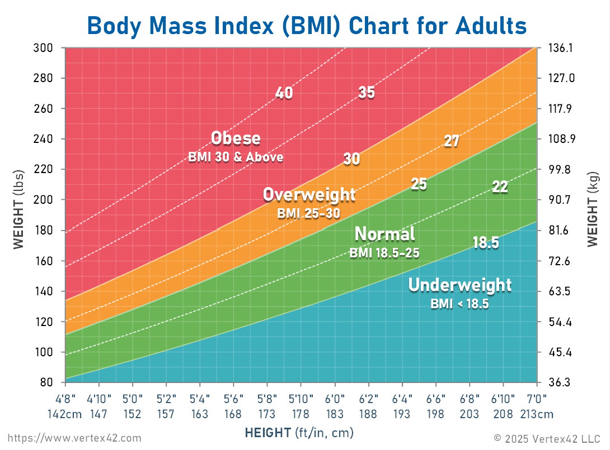

## BMI Calculator 2.0

# Instruction

This is extension of BMI Exercise in previous lesson.
You know how to calculate BMI.
Now you have to display the interpretation of BMI based on BMI value

- Under 18.5 they are **Under weight**
- Over 18.5 and below 25 they are **Normal weight**
- Over 25 and below 30 they are **Over weight**
- Over 30 and below 35 they are **Obese**
- Over 35 they are **Morbidly Obese**
  

**Be Carefull:-** You have to round the result to nearest whole number.

# Example Input

weight = 70

height = 1.68

# Example Output

70 / 1.68 \* 1.68 = 24.801587301

24

Your BMI is 24, You are of Normal Weight

# Solution in soltion.py
