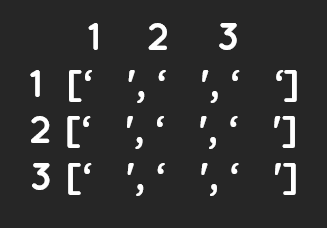

### Mark Map

# Instruction

Write a program to fill or mark the position in 3x3 matrix map with X.

The Matrix Map is of 3 rows and 3 columns

You have enter the position of matrix index using 2 digit number.
First digit is row number and second digit is column number

# Example Input

- 23

* It means 2nd row and 3rd column

# Example Input

# Solution in solution.py
